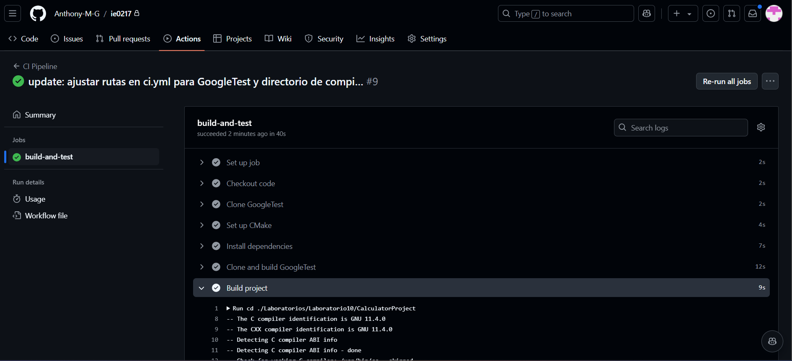

# Laboratorio 10: Pruebas de Software

En este laboratorio, se abordaron los aspectos fundamentales de las **pruebas de software** y su importancia en la verificación y validación de aplicaciones. La sesión destacó cómo las pruebas aseguran que el software cumpla con los requisitos y funcione según lo esperado, contribuyendo a mejorar su calidad, confiabilidad y estabilidad.

### Contenidos

1. **Introducción a las Pruebas de Software**

   - **Pruebas de Software**: Proceso de evaluación que asegura que una aplicación cumple con los requisitos y se comporta según lo esperado. Involucra la ejecución de pruebas para identificar errores y discrepancias respecto a los resultados esperados.

2. **Objetivos de las Pruebas de Software**

   - **Verificación y Validación**: Confirmar que el software hace lo que debería (validación) y cumple con los requisitos (verificación).
   - **Calidad**: Detectar y corregir errores para mejorar la calidad.
   - **Confiabilidad y Estabilidad**: Asegurar que el software funcione de manera estable en diferentes escenarios y condiciones de uso.

3. **Semilla en Pruebas de Software**

   - **Semilla**: Valor inicial en generadores de números aleatorios para reproducibilidad en las pruebas.
   - **Características de la Semilla**:
     - Reproducibilidad: Asegura condiciones de prueba constantes.
     - Control del entorno: Facilita el entorno de prueba y la detección de errores.
     - Facilita el debugging: Permite reproducir errores de manera precisa.

4. **Ciclo de Vida de las Pruebas de Software**

   - **Análisis de Requisitos**: Revisión de requisitos para definir el alcance de las pruebas.
   - **Planificación de Pruebas**: Estrategia, objetivos y casos de prueba específicos.
   - **Diseño de Pruebas**: Desarrollo de escenarios y casos de prueba detallados.
   - **Configuración del Entorno de Prueba**: Preparación de hardware y software necesarios.
   - **Ejecución de Pruebas**: Ejecución de casos de prueba manuales o automatizados.
   - **Informes de Pruebas**: Documentación de resultados y defectos encontrados.
   - **Seguimiento de Defectos**: Registro y resolución de problemas identificados.
   - **Cierre de Pruebas**: Evaluación final y reporte de resultados.

5. **Testing Unitario y Funcional**

   - **Unit Testing**: Pruebas aisladas de unidades individuales (funciones, métodos, clases).
   - **Functional Testing**: Verificación de que el software cumple con los requisitos mediante pruebas orientadas a la funcionalidad.

6. **Cobertura de Código**
   - **Cobertura de Código**: Métrica que mide qué partes del código fueron ejecutadas durante las pruebas.
   - **Tipos de Cobertura**:
     - Cobertura de líneas, sentencias, funciones, condiciones, y ramas.

### Imágenes demostrativas

