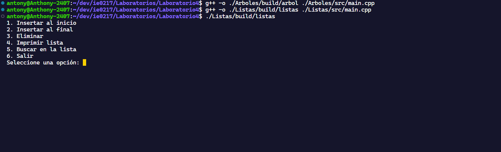
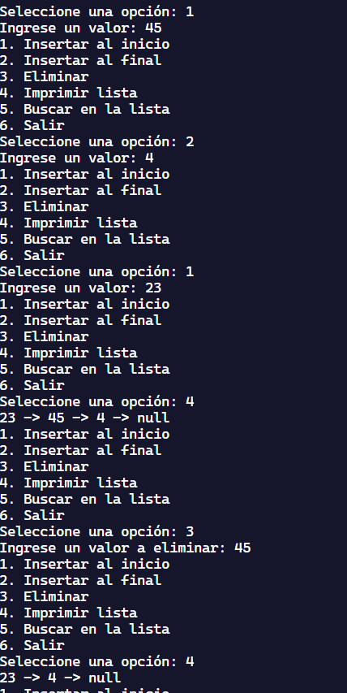
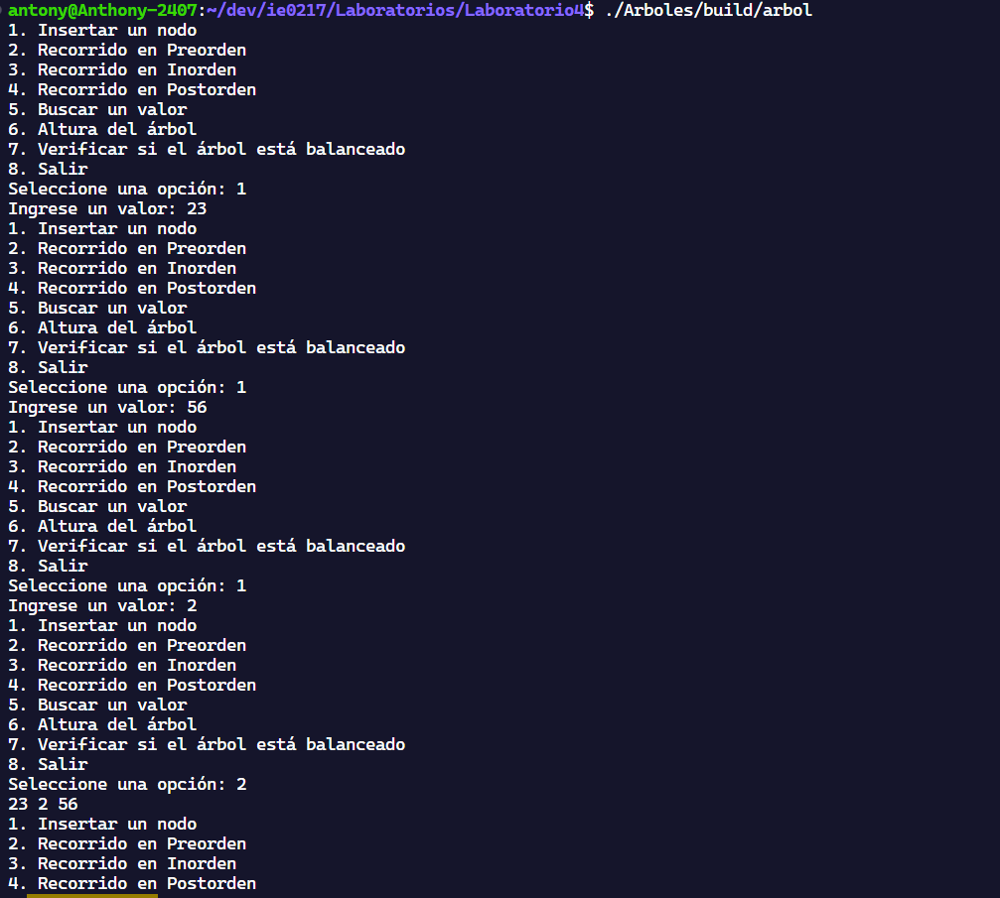

# Laboratorio 04 IE0247

## En este laborario se puso en práctica el uso de listas enlazadas simples y árboles binarios de búsqueda

#### Lista enlazada simple

Una lista enlazada simple es una estructura de datos lineal compuesta por una secuencia de nodos. Cada nodo almacena dos cosas:

Datos: El valor o información que el nodo contiene.
Enlace: Un puntero o referencia al siguiente nodo en la secuencia.
A diferencia de los arreglos (arrays), las listas enlazadas no requieren un bloque de memoria contiguo, lo que permite la inserción y eliminación de elementos de manera eficiente.

#### Árbol binario de búsqueda

Un árbol binario es una estructura de datos jerárquica en la que cada nodo tiene como máximo dos hijos, conocidos como el hijo izquierdo y el hijo derecho. Los árboles binarios son útiles para una variedad de aplicaciones, como la organización de datos, la búsqueda rápida y la implementación de estructuras más complejas como los árboles de búsqueda binarios y los montículos.

### Instrucciones de compilación y ejecución para listas:

En Linux, situándonos en la carpeta raíz:

```bash
g++ -o ./Listas/build/listas ./Listas/src/main.cpp
```

Para ejecutar:

```bash
./Listas/build/listas
```

En Windows, situándonos en la carpeta raíz:

```bash
g++ -o ./Listas/build/listas.exe ./Listas/src/main.cpp
```

Para ejecutar:

```bash
./Listas/build/listas.exe
```

### Instrucciones de compilación y ejecución para arbol binario:

En Linux, situándonos en la carpeta raíz:

```bash
g++ -o ./Arboles/build/arbol ./Arboles/src/main.cpp
```

Para ejecutar:

```bash
./Arboles/build/arbol
```

En Windows, situándonos en la carpeta raíz:

```bash
g++ -o ../Arboles/build/arbol.exe ./Arboles/src/main.cpp
```

Para ejecutar:

```bash
./Arboles/build/arbol.exe
```

### Imágenes

#### Compilando arboles y listas - ejecutando listas



#### Ejecutando listas



#### ejecutando Arbol


