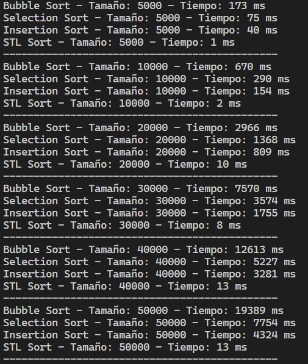
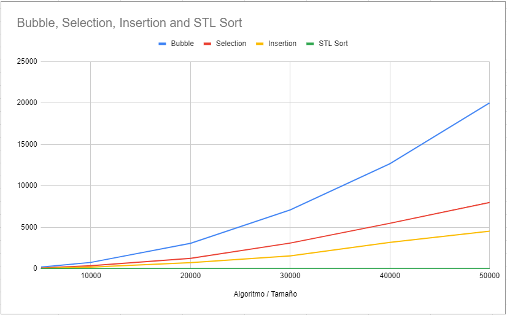

# Laboratorio 05 IE0247

Este proyecto implementa los algoritmos Bubble Sort, Selection Sort, Insertion Sort, y usa `std::sort` para hacer comparaciones de tiempo de ejecución con diferentes tamaños de entrada generada aleatoriamente.

## Algoritmos de Ordenamiento y Complejidades

### 1. **Bubble Sort**

- **Complejidad en el peor caso y promedio**: O(n²)
- **Complejidad en el mejor caso**: O(n) (si la lista ya está ordenada)
- **Descripción**: Compara elementos adyacentes y los intercambia si están en el orden incorrecto. Es muy ineficiente para listas grandes.

### 2. **Selection Sort**

- **Complejidad en el peor, mejor y promedio caso**: O(n²)
- **Descripción**: Busca el elemento mínimo de la lista no ordenada y lo coloca en la posición adecuada. Aunque realiza menos intercambios que Bubble Sort, sigue siendo ineficiente para listas grandes.

### 3. **Insertion Sort**

- **Complejidad en el peor y promedio caso**: O(n²)
- **Complejidad en el mejor caso**: O(n) (cuando la lista está casi ordenada)
- **Descripción**: Inserta cada elemento en su posición correcta mientras recorre la lista, lo que lo hace eficiente para listas pequeñas o parcialmente ordenadas.

### 4. **STL Sort (`std::sort`)**

- **Complejidad en el peor caso**: O(n log n)
- **Complejidad en el mejor y promedio caso**: O(n log n)
- **Descripción**: Utiliza una combinación de QuickSort, HeapSort y otras técnicas de optimización, lo que lo hace mucho más eficiente que los algoritmos anteriores para listas grandes.

## Instrucciones de Compilación

### Linux

1. **Compilar el proyecto**:

   ```bash
   g++ -o build/main_algorithms main.cpp src/SortAlgorithms.cpp -I includes -std=c++11
   ```

   Esto compilará el archivo `main.cpp` junto con la implementación de los algoritmos en `SortAlgorithms.cpp`, generando el ejecutable `main_algorithms` en la carpeta `build`.

2. **Ejecutar el programa**:
   ```bash
   ./build/main_algorithms
   ```

### Windows

1. **Compilar el proyecto** usando MinGW o cualquier compilador de C++:

   ```bash
   g++ -o build/main_algorithms.exe main.cpp src/SortAlgorithms.cpp -I includes -std=c++11
   ```

   Esto generará el archivo ejecutable `main_algorithms.exe` en la carpeta `build`.

2. **Ejecutar el programa**:
   ```bash
   ./build/main_algorithms.exe
   ```

## Ejecución del Programa

El programa genera vectores de números aleatorios de diferentes tamaños y los ordena usando los cuatro algoritmos. Se mide el tiempo de ejecución de cada algoritmo para diferentes tamaños de entrada y los resultados se muestran en la consola.

## Imágenes de Resultados

A continuación, se muestran algunos gráficos que comparan el tiempo de ejecución de los diferentes algoritmos:


_Comparación del tiempo de ejecución de los algoritmos de ordenamiento con diferentes tamaños de entrada._


_Análisis detallado del tiempo de ejecución para cada algoritmo._
