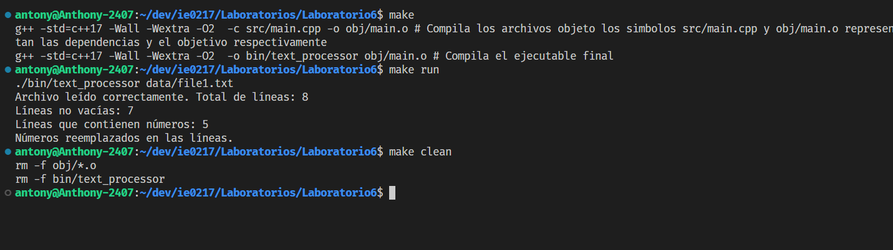

# Laboratorio 06 IE0217

Este proyecto implementa un programa para procesar textos utilizando diversas utilidades como manejo de excepciones, lectura de archivos y expresiones regulares.

### Descripción de Directorios

- `bin/`: Contiene los ejecutables generados tras la compilación.
- `data/`: Carpeta con archivos de texto de ejemplo para ser procesados por el programa.
- `obj/`: Almacena los archivos objeto generados durante la compilación.
- `src/`: Contiene los archivos fuente del proyecto:
  - `Exceptions.hpp`: Define las excepciones utilizadas en el proyecto.
  - `FileReader.hpp`: Maneja la lectura de archivos.
  - `RegexUtils.hpp`: Utilidades para trabajar con expresiones regulares.
  - `TextProcessor.hpp`: Lógica principal del procesamiento de textos.
  - `main.cpp`: Archivo principal que orquesta la ejecución del programa.

## Instrucciones de Compilación (Linux)

1. **Compilar el proyecto**:

   ```bash
   make
   ```

2. **Ejecutar el programa**:
   ```bash
   ./bin/text_processor
   ```
3. **Eliminar los archivos creados**:
   ```bash
   ./bin/text_processor
   ```

### Imagen de compilación y ejecución del programa


Compilación y ejecución del programa
