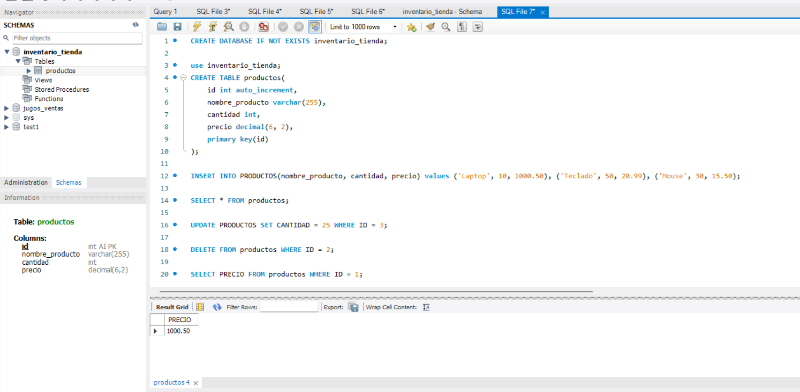
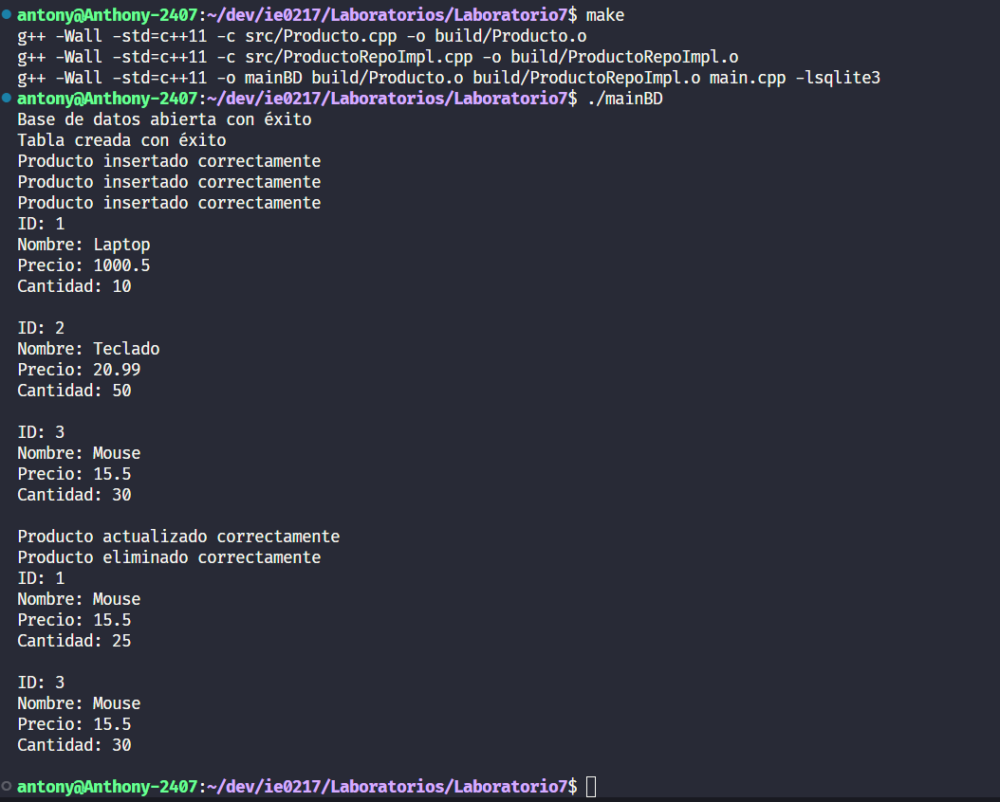

# Laboratorio 07 IE0247

## Ejercicio 1: Creación de la Base de Datos y Tablas

1. **Configuración del servidor de base de datos**

   - Configurar MySQL como sistema de gestión de base de datos (SGBD).

2. **Creación de la base de datos**

   - Crear una base de datos llamada `inventario_tienda`, la cual almacenará la información relacionada con los productos.

3. **Creación de la tabla `productos`**
   - Dentro de la base de datos, se crea una tabla llamada `productos` con los siguientes campos:
     - `id`: Entero autoincremental, que funciona como clave primaria para identificar de manera única a cada producto.
     - `nombre_producto`: Cadena de texto que almacena el nombre del producto (hasta 255 caracteres).
     - `cantidad`: Número entero que indica el stock disponible de cada producto.
     - `precio`: Valor decimal con dos lugares decimales, que representa el precio de cada producto.

## Parte 2: Inserción de Datos

- Se inserta información de tres productos en la tabla `productos`. Los productos agregados son:
  - Laptop (Cantidad: 10, Precio: 1000.50)
  - Teclado (Cantidad: 50, Precio: 20.99)
  - Mouse (Cantidad: 30, Precio: 15.50)

## Parte 3: Consultas SQL

1. **Consulta de todos los productos**

   - Se seleccionan todos los productos almacenados en la tabla `productos` para visualizarlos.

2. **Actualización de cantidad de un producto**

   - Se actualiza la cantidad del producto 'Mouse' cambiando el valor de stock a 25 unidades.

3. **Eliminación de un producto**

   - Se elimina el producto 'Teclado' de la tabla, identificándolo por su ID.

4. **Consulta del precio de un producto específico**
   - Se consulta el precio del producto 'Laptop', identificándolo también por su ID.

## Parte 4: Discusión

### Ventajas de usar un SGBD como MySQL

Un sistema de gestión de bases de datos como MySQL ofrece numerosas ventajas sobre métodos tradicionales, tales como:

- **Escalabilidad**: Permite manejar grandes cantidades de datos sin comprometer el rendimiento.
- **Integridad de los datos**: A través de restricciones como claves primarias y tipos de datos, se asegura que la información almacenada sea válida y consistente.
- **Consultas eficientes**: MySQL permite realizar consultas rápidas y optimizadas sobre los datos almacenados.
- **Seguridad**: Ofrece control sobre los accesos y permisos, garantizando que solo usuarios autorizados puedan realizar modificaciones.

### Manejo de concurrencia en MySQL

MySQL gestiona la concurrencia utilizando mecanismos como bloqueos a nivel de filas y transacciones. Estos mecanismos aseguran que múltiples usuarios puedan acceder y modificar datos de manera simultánea sin que se generen conflictos o pérdida de información. Las transacciones permiten que todas las operaciones dentro de ellas se realicen de manera atómica, garantizando que se mantenga la consistencia de los datos.



## Ejercicio 2: SQLITE3 Y C++

En este ejercicio decidí agregar algunas funcionalidades más que había aprendido en Java antes dado que se parece mucho, realicé un CRUD utilizando clases y mapeando los resultados de las consultas sql a una clase en c++.

Clase Producto:

- id
- nombre
- precio
- cantidad

Clase ProductoRepositorio: Clase abstracta que define los métodos a utilizar para interactuar con la BD.

Clase ProductoRepositorioImpl: Clase que hereda de ProductoRepositorio e implementa todos los métodos.

Decidí hacerlo de esta manera para ir practicando para el proyecto que se avecina.

Ejemplo de salida:


### Intrucciones de compilación

### En Linux:

1. Abra una terminal en el directorio del proyecto.
2. Ejecute el siguiente comando:

```bash
make
```

Esto generará un ejecutable llamado `mainBD`.

### En Windows:

1. Asegúrese de tener MinGW instalado y configurado en su PATH.
2. Abra una terminal (Command Prompt o PowerShell) en el directorio del proyecto.
3. Ejecute el siguiente comando:

```cmd
mingw32-make
```

Esto generará un ejecutable llamado `mainBD.exe`.

## Ejecución

### En Linux:

Para ejecutar el programa, use el siguiente comando:

```bash
./mainBD
```

### En Windows:

Para ejecutar el programa, use el siguiente comando:

```cmd
mainBD.exe
```

## Limpieza

Para eliminar los archivos objeto y el ejecutable:

### En Linux:

```bash
make clean
```

### En Windows:

```cmd
mingw32-make clean
```
