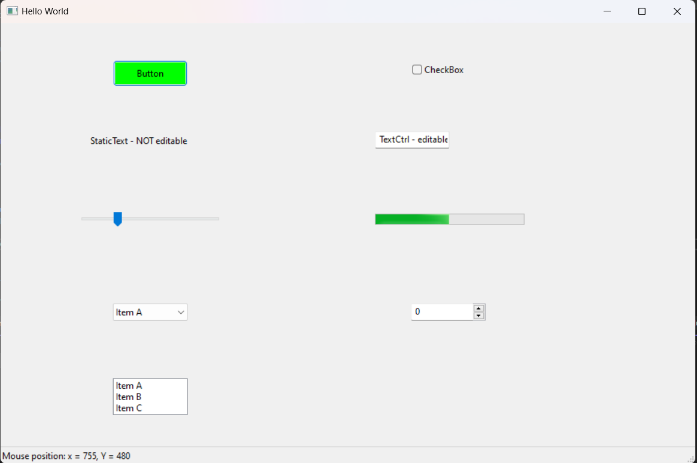

# Sesión 10: wxWidgets y Creación de Ventanas en Visual Studio

En esta sesión se utilizó **wxWidgets** para la creación de interfaces gráficas de usuario (GUI) en C++ mediante **Visual Studio**. wxWidgets es una biblioteca C++ que permite el desarrollo de aplicaciones con interfaces gráficas multiplataforma.

## Contenidos

- **wxWidgets**: Biblioteca para crear interfaces gráficas de usuario.
- **Visual Studio**: Entorno de desarrollo integrado (IDE) para escribir y compilar código C++.
- **Creación de Ventanas**: Cómo crear ventanas básicas utilizando wxWidgets.

## wxWidgets

wxWidgets es una biblioteca multiplataforma que permite la creación de aplicaciones con interfaz gráfica en diferentes sistemas operativos sin cambiar el código. Facilita el desarrollo de aplicaciones que se ven y se comportan de manera nativa en cada plataforma.

### Ventana Básica en wxWidgets

Para crear una ventana básica en wxWidgets, se requiere una clase que herede de `wxFrame`:

```cpp
#include <wx/wx.h>

class MyApp : public wxApp {
public:
    virtual bool OnInit();
};

class MyFrame : public wxFrame {
public:
    MyFrame(const wxString& title);
};

wxIMPLEMENT_APP(MyApp);

bool MyApp::OnInit() {
    MyFrame *frame = new MyFrame("Ventana wxWidgets");
    frame->Show(true);
    return true;
}

MyFrame::MyFrame(const wxString& title) : wxFrame(nullptr, wxID_ANY, title) {
}
```

Este ejemplo crea una ventana simple con el título "Ventana wxWidgets".

## Requisitos

- **Visual Studio 2019 o posterior** con soporte para C++.
- **wxWidgets** instalado en tu sistema.

## Instrucciones de Instalación

### Instalación de wxWidgets en Windows

1. Descarga **wxWidgets** desde el sitio oficial: [https://www.wxwidgets.org/downloads/](https://www.wxwidgets.org/downloads/).
2. Extrae el archivo descargado en una carpeta de tu elección, por ejemplo, `C:\wxWidgets`.
3. Abre **Visual Studio** y selecciona `Developer Command Prompt` desde el menú de inicio.
4. En la terminal, navega al directorio de wxWidgets y ejecuta el siguiente comando para compilar wxWidgets:

   ```bash
   mingw32-make -f makefile.vc BUILD=release
   ```

   Esto creará la biblioteca wxWidgets en el modo de compilación `release`.

### Configuración de Visual Studio

1. Abre **Visual Studio** y crea un nuevo proyecto de C++.
2. En el menú `Project > Properties`, ajusta las siguientes configuraciones:
   - **Include Directories**: Añade la ruta `C:\wxWidgets\include` y `C:\wxWidgets\lib\vc_lib\mswud`.
   - **Library Directories**: Añade `C:\wxWidgets\lib\vc_lib`.
   - En **Linker > Input**, añade las bibliotecas: `wxmsw31u_core.lib` y `wxbase31u.lib`.
3. Configura tu proyecto para que compile con las opciones de depuración (`Debug`) y 32 bits (`x86`).

## Instrucciones de Uso

### Compilar y Ejecutar el Proyecto

1. Una vez configurado Visual Studio, asegúrate de que has escrito correctamente tu código que incluye la creación de la ventana con wxWidgets.
2. Compila el proyecto seleccionando `Build > Build Solution` o presionando `Ctrl+Shift+B`.
3. Ejecuta la aplicación seleccionando `Debug > Start Debugging` o presionando `F5`.

### Crear una Ventana Básica

El código base para crear una ventana ya está disponible en la sección anterior. Al ejecutar el programa, deberías ver una ventana vacía con el título que hayas proporcionado.

## Imágenes


Compilación y ejecución del programa

