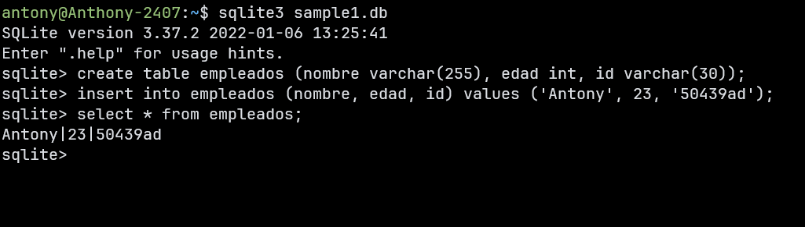
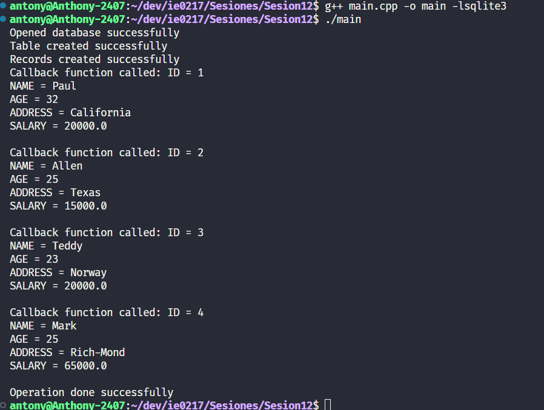

# Sistemas Gestores de Bases de Datos

En esta sesión exploré dos sistemas gestores de bases de datos clave en el desarrollo de software: **SQLite3** y **MySQL**. Ambos tienen aplicaciones específicas y ofrecen soluciones eficientes para almacenar y gestionar datos, tanto en entornos locales como en la nube.

## Contenidos

- **SQLite3 en Linux**: Cómo gestionar bases de datos locales en Linux.
- **SQLite3 con C++**: Integración de SQLite con C++ para la manipulación de bases de datos.
- **MySQL en AWS**: Uso de MySQL en entornos de nube con Amazon Web Services (AWS).

## SQLite3 en Linux

**SQLite3** es un sistema gestor de bases de datos que no requiere un servidor, lo que lo hace ideal para proyectos pequeños y aplicaciones locales. En esta práctica, creé una base de datos y gestioné datos directamente desde la terminal de Linux.

### Ejemplo de uso

Primero, creé una tabla llamada `empleados` e inserté algunos registros:

```sql
CREATE TABLE empleados (nombre varchar(255), edad int, id varchar(30));
INSERT INTO empleados (nombre, edad, id) VALUES ('Antony', 23, '50439ad');
SELECT * FROM empleados;
```

Este sencillo ejemplo me permitió trabajar con datos locales y ver los resultados de inmediato en la terminal. Aquí puedes ver cómo se ve la salida en Linux:



## SQLite3 con C++

Otra parte de mi práctica fue integrar **SQLite3** con **C++**, lo que me permitió interactuar con la base de datos directamente desde el código. Utilicé un programa en C++ que crea una tabla e inserta registros de forma automática.

### Compilación y ejecución

Para compilar y ejecutar el programa en Linux, utilicé el siguiente comando:

```bash
g++ main.cpp -o main -lsqlite3
./main
```

La salida del programa en la terminal se ve así:



## MySQL en AWS

**MySQL** es uno de los sistemas de bases de datos más utilizados a nivel empresarial, especialmente en entornos de gran escala. En este caso, configuré una base de datos MySQL en **Amazon Web Services (AWS)**, lo que me permitió gestionar datos de manera remota y escalable.

### Conexión a MySQL en AWS

Para conectarme a una instancia de MySQL en AWS, usé el siguiente comando desde un cliente MySQL:

```bash
mysql -h <endpoint> -u <usuario> -p
```

Aquí, `<endpoint>` es la dirección de la instancia en AWS. Esta configuración me permitió realizar consultas y gestionar datos remotamente, aprovechando la infraestructura de la nube.

---

## Conclusión

Trabajar con **SQLite3** y **MySQL** me ha permitido comprender mejor las diferencias entre los sistemas de bases de datos locales y en la nube. SQLite es una solución ligera y fácil de implementar para aplicaciones pequeñas, mientras que MySQL, especialmente en combinación con AWS, es una herramienta potente para manejar grandes volúmenes de datos en aplicaciones distribuidas.
