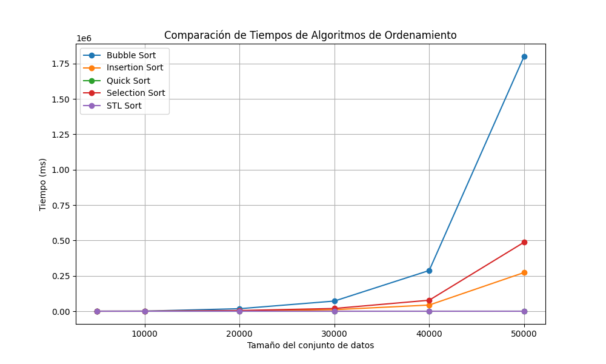
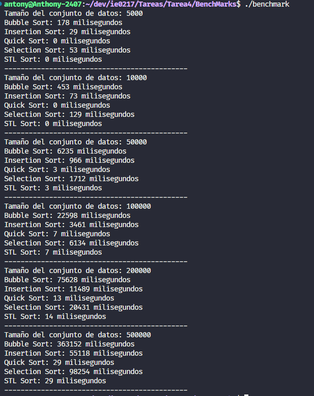

# Benchmark de Algoritmos de Ordenamiento

Este proyecto realiza un benchmark comparativo de varios algoritmos de ordenamiento, incluyendo **Bubble Sort**, **Insertion Sort**, **Quick Sort**, **Selection Sort**, y **std::sort** de la biblioteca estándar de C++. Los resultados del benchmark se muestran en forma de tiempo de ejecución para diferentes tamaños de conjuntos de datos.

## Estructura del Proyecto

```
.
├── Makefile
├── README.md
├── comparacion_tiempos_algoritmos.png
├── data
│   ├── graphics.py
│   └── resultados.txt
├── image.png
├── includes
│   └── AlgoritmosDeOrdenamiento.hpp
└── main.cpp
```

- **Makefile**: Archivo de compilación para generar el ejecutable.
- **comparacion_tiempos_algoritmos.png**: Imagen con la gráfica de comparación de tiempos de los algoritmos.
- **data/graphics.py**: Script en Python para generar gráficas a partir de los resultados del benchmark.
- **data/resultados.txt**: Archivo con los resultados crudos de las pruebas de rendimiento.
- **includes/AlgoritmosDeOrdenamiento.hpp**: Implementación de los algoritmos de ordenamiento.
- **main.cpp**: Archivo principal donde se ejecuta el benchmark.

## Requisitos

- **Linux**: `g++`, `make`.
- **Windows**: `g++` (MinGW) o `WSL`, `mingw32-make`.
- **Python 3** (opcional, para generar gráficas).

## Instrucciones de Compilación

### Compilación en Linux

1. Para compilar el proyecto, abre una terminal en el directorio del proyecto y ejecuta el siguiente comando:

   ```bash
   make
   ```

2. Para ejecutar el programa:

   ```bash
   ./benchmark
   ```

### Compilación en Windows

#### Opción 1: Usando MinGW

1. Abre una terminal en el directorio del proyecto y ejecuta el siguiente comando:

   ```bash
   mingw32-make
   ```

2. Para ejecutar el programa:

   ```bash
   .\benchmark.exe
   ```

#### Opción 2: Usando WSL

1. Abre una terminal de WSL y ejecuta el siguiente comando:

   ```bash
   make
   ```

2. Para ejecutar el programa:

   ```bash
   ./benchmark
   ```

## Limpiar Archivos de Compilación

Para eliminar los archivos objeto y el ejecutable generado, utiliza el siguiente comando:

- **Linux/WSL**:

  ```bash
  make clean
  ```

- **Windows (MinGW)**:

  ```bash
  mingw32-make clean
  ```

## Gráficos

Los resultados de los tiempos de ejecución se guardarán en `data/resultados.txt`. Puedes generar gráficos comparativos ejecutando el siguiente comando:

```bash
python3 data/graphics.py
```

Esto generará una imagen comparativa de los algoritmos de ordenamiento como la siguiente:



Luego de compilar 10 ejecuciones para tamaños de datos como 5000, 10000, 50000, 100000, 200000, 500000:


