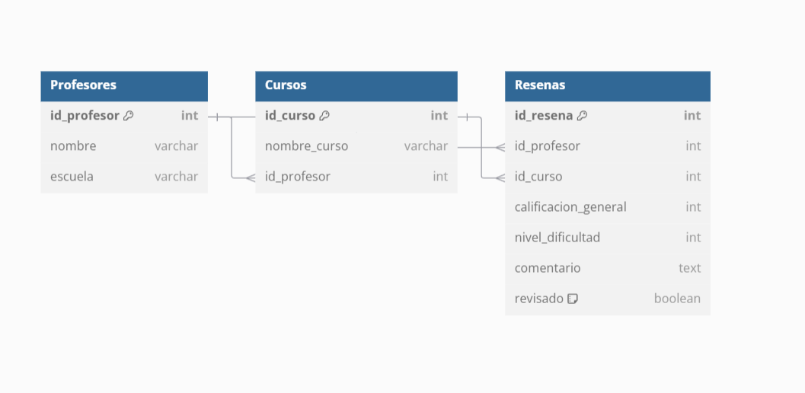

Sistema de Reseñas de Cursos y Profesores

# Sistema de Reseñas

Este proyecto implementa un sistema de reseñas para cursos y profesores utilizando C++ y una base de datos MySQL alojada en una instancia de Railway. Permite a los usuarios interactuar con los datos de reseñas, consultando, actualizando y eliminando información de manera eficiente.

## Descripción del Ejercicio

La Universidad XYZ ha decidido implementar un sistema de reseñas para mejorar la retroalimentación y la calidad de la enseñanza. Como parte del equipo de desarrollo, se ha diseñado y creado una base de datos en MySQL que almacena la información de reseñas de profesores. Esto permite a los estudiantes calificar a sus profesores y dejar comentarios sobre los cursos que han tomado, con funcionalidades para consultar y gestionar los datos de las reseñas.

## Base de Datos

La base de datos está alojada en Railway y cuenta con las siguientes tablas:

Diagrama E-R:



### Profesores

- `id_profesor` (INT, clave primaria, auto_increment): Identificador único del profesor.
- `nombre` (VARCHAR): Nombre del profesor.
- `escuela` (VARCHAR): Nombre de la escuela a la que pertenece el profesor.

### Cursos

- `id_curso` (INT, clave primaria, auto_increment): Identificador único del curso.
- `nombre_curso` (VARCHAR): Nombre del curso.
- `id_profesor` (INT, clave foránea): Referencia al profesor que imparte el curso. Se elimina en cascada si el profesor se elimina.

### Reseñas

- `id_resena` (INT, clave primaria, auto_increment): Identificador único de la reseña.
- `id_profesor` (INT, clave foránea): Referencia al profesor calificado. Se elimina en cascada si el profesor se elimina.
- `id_curso` (INT, clave foránea): Referencia al curso calificado. Se elimina en cascada si el curso se elimina.
- `calificacion_general` (INT): Calificación general del curso/profesor, de 1 a 5.
- `nivel_dificultad` (INT): Nivel de dificultad del curso, de 1 a 5.
- `comentario` (TEXT): Comentario del estudiante sobre el curso/profesor.
- `revisado` (BOOLEAN): Indica si la reseña ha sido revisada (0 = No, 1 = Sí).

## Datos de Ejemplo

Para probar el sistema, se han insertado algunos datos de ejemplo en la base de datos que se pueden consultar a partir de todos los profesores, todos los cursos y todas las reseñas:

## Consultas Implementadas

Las siguientes consultas son ejecutadas desde el código en C++ para interactuar con la base de datos:

- Filtrado por curso y escuela.
- Consulta y ordenación por calificación y dificultad.
- Búsqueda de reseñas no revisadas.
- Actualización del estado de una reseña.
- Consulta con filtración compleja y uso de alias.
- Eliminación de una reseña específica y conteo de reseñas eliminadas de un curso.
- Consultar todos los profesores
- Consultar todos los cursos

## Requisitos

- **Compilador**: Se requiere un compilador compatible con C++11 o superior.
- **Sistema Operativo**: Windows, Linux, o cualquier sistema que soporte `make` o `mingw32-make`.
- **Herramientas**:
  - `make` o `mingw32-make` para compilar.
  - Conexión a la base de datos MySQL en Railway.

## Instrucciones de Compilación

### En sistemas Linux o WSL con `make`

1. Clona el repositorio y navega a la carpeta del proyecto.
2. Abre una terminal en la raíz del proyecto.
3. Compila el proyecto con:

   ```bash
   make
   ```

4. Si la compilación es exitosa, se generará el ejecutable en la misma carpeta.
5. Ejecuta el programa:

   ```bash
   ./main
   ```

### En sistemas Windows con `mingw32-make`

1. Clona el repositorio y abre una terminal de `mingw32` en la carpeta del proyecto.
2. Compila el proyecto con:

   ```bash
   mingw32-make
   ```

3. Si la compilación es exitosa, se generará un archivo `.exe` en la carpeta raíz.
4. Ejecuta el programa:

   ```bash
   ./main.exe
   ```

## Configuración de la Base de Datos

1. Asegúrate de que tu instancia de MySQL en Railway esté corriendo y que los parámetros de conexión (host, puerto, usuario, contraseña) estén configurados correctamente en el código C++.
2. Importa el esquema de la base de datos utilizando los comandos SQL proporcionados:

   ```sql
   CREATE DATABASE IF NOT EXISTS SistemaResenas;
   USE SistemaResenas;
   -- Comandos para crear las tablas y datos de ejemplo...
   ```

3. Asegúrate de que las tablas `Profesores`, `Cursos`, y `Resenas` estén creadas y de que tengan los datos necesarios para ejecutar las consultas.

## Documentación

Este proyecto está documentado utilizando Doxygen. Para generar la documentación, asegúrate de tener Doxygen instalado y ejecuta el siguiente comando en la terminal:

```bash
doxygen Doxyfile
```

Esto generará la documentación en formato HTML en la carpeta `docs`.
